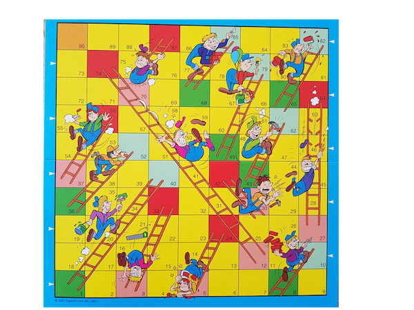

# Oppgave - stigespillet

1. Studer bildet av stigespillet: 
1. Studer koden som ligger i [model.js](model.js)
1. Fullfør modellen ut fra informasjonen som finnes i bildet av spillet.
1. Lag en funksjon som tar et rutenr som argument og returnerer riktig css-klasse for denne ruten.
   Output skal være som følger: 
    - 90 => `'finish'`
    - alle ruter hvor det starter en stige som går oppover => `'ladderStartUp'`
    - alle ruter hvor det starter en stige som går nedover => `'ladderStartDown'`
    - alle ruter hvor det ender en stige som går oppover => `'ladderEndUp'`
    - alle ruter hvor det starter en stige som går nedover => `'ladderEndDown'`
    - alle andre ruter => `''`
1. Lag en unit test for hvert av tilfellene over
1. Lag en view-funksjon som tegner opp brettet som et 9x9 rutenett basert på `model.drawingSequence`. Bruk css-grid. For å få riktig farge på hver rute, brukes funksjonen over, samt at de tilsvarende css-klassene må lages. Ruter som ikke får noen css-klasse skal være gule. 
1. Legg inn et felt i modellen for verdi av et terningkast (med verdien 6 fra start). Oppdater viewet slik at den viser riktig terning. Bruk unicode-tegnene for terning: ⚀⚁⚂⚃⚄⚅ Vis dem i en tagg med css som gjør at de får en passe størrelse. 
1. Lag en knapp for å kaste terningen. Den skal endre verdien i modellen og så oppdatere viewet, slik at man ser den nye verdien. 
1. Legg inn et felt i modellen for hvor spillbrikken er, og la denne starte på 1. Endre viewet, slik at den tegner opp en spillbrikke, `'⛂'`, i riktig rute. 
1. Lag en knapp for å flytte brikken ut fra verdien på terningen. Denne skal ta hensyn til stigene. Lag minst tre unit tester, en for stige opp, en for stige ned, og en uten stige. 
1. Lag logikk slik at hvis man har kastet terningen, så kan man ikke kaste den på nytt før man har trykket på knappen for å flytte. Og tilsvarende, at hvis man har trykket på knappen for å flytte, så kan man ikke gjøre det igjen før man har trillet terningen igjen. 
1. Kjenn igjen om spilleren har vunnet og vis en tekst om dette. 
1. Unit test at følgende terningkast etter hverandre vil føre til at man har vunnet: `[1, 3, 3, 4, 4]`
1. Lag en annen sekvens av terningkast som ikke vinner og unit test det stemmer
1. Legg til støtte for at man kan spille med 1, 2, 3 eller fire spillere og at hver spiller får en egen brikke med en egen farge. Bruk feks. `['green', 'red', 'blue', 'yellow']`.